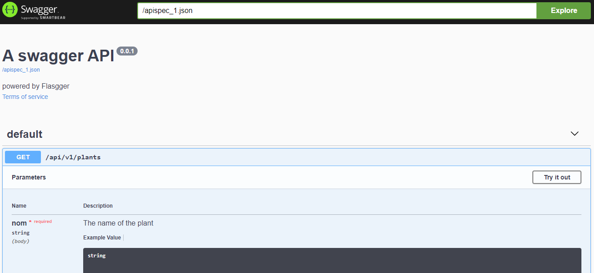
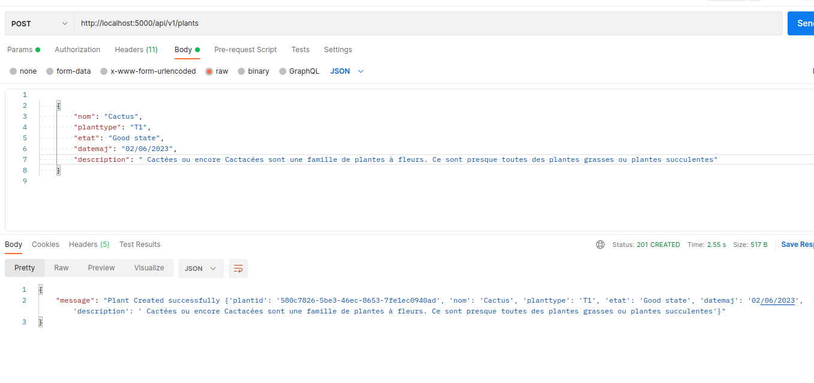
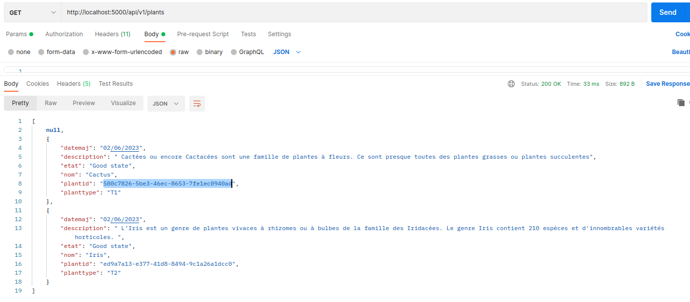
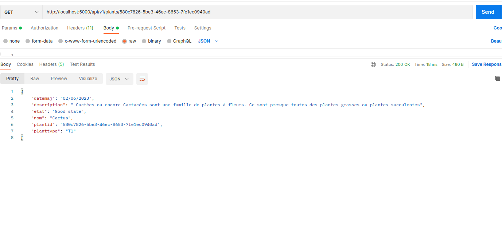
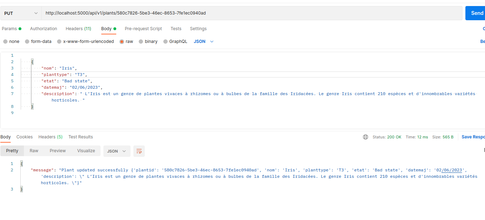
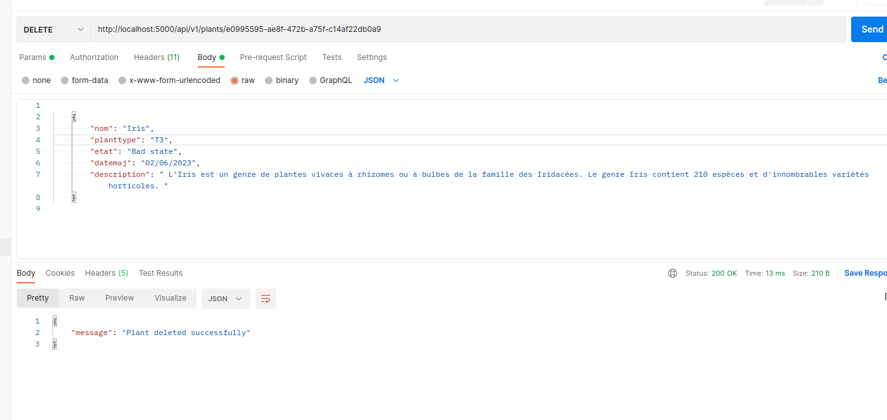

# Plant Management API

This project provides a simple API for managing plants using Flask and Swagger.

## Prerequisites

Before running this application, make sure you have the following prerequisites installed:

- Python 3.x
- Flask 2.0.2
- Flask-Caching 1.10.1
- Flasgger 0.9.5

## Installation

1. Clone the repository:

 git clone https://github.com/saberbenhouma/Plant_project_2.git

Navigate to the project directory:
cd Plant_project_2

pip install -r requirements.txt

python app.py
The API is now accessible at http://localhost:5000/api/v1/plants.

Open your web browser and navigate to http://localhost:5000/apidocs/index.html to view the Swagger UI documentation.

##API Endpoints - POSTMAN

POST /api/v1/plants - Create a new plant.

GET /api/v1/plants - Get a list of all plants.

GET /api/v1/plants/{plantid} - Get a specific plant by ID.

PUT /api/v1/plants/{plantid} - Update a specific plant by ID.

DELETE /api/v1/plants/{plantid} - Delete a specific plant by ID.

